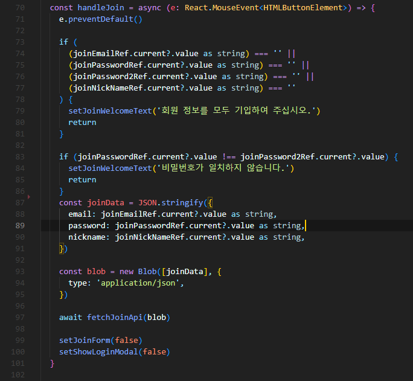

# 프로젝트 소개 | Compass 나침반

 

#### 시연 영상 링크:
https://drive.google.com/file/d/1TbwsMCSeGHi0Du9lxwXTVvzyJ-tJADbO/view?usp=sharing

 

### 🖼 **기획 배경**
📢 코로나 방역이 완화되고 날씨가 따뜻해지는 요즘, 계획 세우는 것이 어려워 여행을 주저하는 모든 분들이 쉽고 간편하게 여행 테마 선택과 여행지에 대한 정보를 얻어 여행 계획의 효율성 향상을 위해 기획하게 되었습니다.

📰 [http://www.seoulwire.com/news/articleView.html?idxno=497658](http://www.seoulwire.com/news/articleView.html?idxno=497658)

 

### 📈 **기대 효과**
📌 유저는 10가지의 테마 선택을 통해서 기대하는 여행지의 모습을 선택할 수 있습니다!

📌 유저는 사전답사 없이도 이전 방문객의 글을 통해서 다양한 정보를 얻을 수 있습니다!

 

이번 프로젝트는 프론트엔드 개발자 2명, 백엔드 개발자 4명으로 이루어져 ‘Compass (나침반)’이라는 커뮤니티 플랫폼 프로젝트를 진행하였습니다. 플랫폼 유저분들이 여행 계획을 세움에 있어 방황하지 않고 ‘Compass’가 나침반이 되어 방향성을 제공해 드릴 수 있는 플랫폼이 되고자 시작하였습니다. 백엔드와 프론트엔드가 협업으로 진행하는 만큼 type에서의 오류만큼은 최소화하기 위해 프론트엔드 언어는 typescript를 사용하였고, 전역적으로 관리해야 하는 유저정보나 테마정보는 redux-toolkit을 사용하여 진행하였습니다.
 
 

## 개발 과정

### 🛠 **와이어프레임**

https://www.figma.com/file/1koGclNNTmJZVIykCVl1JZ/1seok4jo?type=design&node-id=0%3A1&t=2cykVeYZXKS1pRFp-1

 

### 🗄 API 명세서

[API 명세서](https://www.notion.so/API-626bdd41fdbf4758a682ab29294187b5)
 

### 🧾 **ERD**

 

## 담당한 기능(엄성준)

### 회원 가입 / 로그인

- 기능 소개 : 스프링시큐리티를 이용한 토큰방식으로 개발된 회원가입 및 로그인 기능 입니다.
- 기능 구현 : 회원 가입 및 로그인 입력 폼 의 정보를 읽을 때 useState()를 사용하지 않고 useRef()를 사용했습니다. 그 이유는 useState()를 사용했을 때 input에 onChange 이벤트가 발생할 때마다 불필요한 리렌더링이 발생하기 때문에 useRef()를 이용해서 입력 정보를 관리 했습니다.

### 회원 가입
 
 

회원가입에 대한 예외 처리를 해주었고 입력 된 이메일, 비밀번호, 닉네임은 JSON 형태로 변환하였고 변환 된 JSON 형태의 정보를 Blob 형태로 변환하여 fetchJoinApi()의 인자로 넘겨주었습니다.

  

fetchJoinApi 함수는 blobData를 인자로 받아서, 그 데이터를 FormData 객체인 joinData에 append를 통해 추가합니다. 그리고 axios 라이브러리를 이용하여 POST 메서드로 서버에 joinData를 전송했습니다.

### 로그인

  

로그인에 대한 예외 처리를 해주었고 입력 된 이메일과 비밀번호를 fetchLoginApi()의 인자로 넘겨주었습니다.

  

fetchLoginApi() 함수는 이메일과 비밀번호를 받아서 axios 라이브러리를 이용하여 POST 메서드로 서버에 전송해 주었고 그 후 서버에서 반환받은 response에서 reponse.data를 추출하여 retrun 해주었습니다.

response.data를 loginResult 변수에 할당해 주었고, react의 useCookie() hook을 이용해서 ‘token’이라는 키값으로 로그인 시 서버에서 전달받은 토큰 값을 저장해 주었습니다. 그 후 setUser() 함수에 loginResult 객체를 전달해 주었고 구조 분해 할당을 통해서 유저의 정보를 업데이트해 주었고 또한 로컬 스토리지에 현재 state 값을 JSON 형태로 저장해 주었습니다.

### 비밀번호 초기화

- 기능 소개 : 비밀번호를 기억하지 못하는 경우, 가입한 이메일을 입력하면 서버에서 초기화 코드를 생성하고 해당 이메일 주소로 초기화 코드를 보냅니다. 사용자는 초기화 코드와 새로운 비밀번호를 입력하면 새로운 비밀번호를 설정할 수 있는 기능입니다.
- 기능 구현 : 사용자가 이메일을 입력하면, 서버는 입력된 이메일 주소를 받아와 Mailjet API를 사용하여 해당 이메일 주소로 초기화 코드를 포함한 이메일을 보냅니다. 그 후 이메일을 받은 사용자는 초기화 코드와 함께 새로운 비밀번호를 서버에 전송하게 되고 서버에서 입력된 초기화 코드의 유효성을 확인하고 새로운 비밀번호가 조건을 충족한다며 비밀번호를 재 설정합니다.

  

 

### 회원 탈퇴

- 기능 소개 : 회원 탈퇴 기능입니다.
- 기능 구현 : 회원 탈퇴 버튼을 눌렀을 때 보이는 주의 사항에 동의한 후 탈퇴하기를 하면 fetchDeleteUserApi()의 인자로 현재 로그인 된 사용자의 토큰 값을 전송하면 axios 라이브러리를 이용하여 DELETE 메서드로 authorization 헤더에 토큰 값을 담아 서버에 전송합니다. 서버에서는 해당 토큰 값을 검증하여 사용자가 인증되었는지 확인하고 계정을 삭제합니다.

  

회원 탈퇴 요청이 성공적으로 진행됐을 때 cookie 값과 로컬 스토리지에 저장된 유저 정보를 초기화합니다.

  

### 마이페이지 프로필 배너 관리

- 기능 소개 : 마이페이지의 프로필 관리 기능은 Redux를 활용하여 사용자 정보를 관리합니다. 사용자 정보는 Redux 상태에 저장되어 있으며, 이를 통해 프로필 정보를 가져와 보여줍니다. 프로필 배너 편집은 회원정보 수정 페이지에서 수정할 수 있으며 프로필 이미지나 배경 이미지는 업로드한 이미지를 미리 확인할 수 있습니다. 또한 수정하기 버튼을 누를 경우 서버와의 통신을 통해 회원정보를 수정합니다.
- 기능 구현

  

로그인 상태에 따라 조건부 렌더링을 해주었고 useSelector 훅을 사용하여 Redux 상태에서 사용자 정보를 가져온 후 랜더링 해주었습니다.

  

프로필 이미지, 배경 이미지 수정 시 이미지 파일을 업로드하기 전에 서버에서 받아온 현재 이미지가 null이라면 기본 이미지를 보여주고, 사진을 업로드하였을 때 OnChange 이벤트가 발생하면 FileReader를 통해 업로드한 사진을 미리 보여줍니다.

  

 

 

EditForm에서 onSubmit 이벤트가 발생하면 handleEditForm 함수가 실행되고 입력된 비밀번호 와 나를 소개하는 한 줄 문장은 JSON 형태로 변환한 후 Blob 형식으로 묶어서 stringBlob 변수에 할당합니다. fetchProfileEditApi() 함수의 인자로 stringBlob과 프로필 이미지, 배경 이미지는 파일 그리고 토큰을 넘겨줍니다. fetchProfileEditApi() 함수는 전달받은 데이터를 FormData 객체에 추가해 주고 axios를 사용하여 PUT 메서드로 FormData를 서버에 전송합니다. 응답이 정상적으로 수신되면 userDispatch 함수를 사용하여 editUser 액션을 호출하여 사용자의 정보를 업데이트합니다. 또한 Redux 상태를 수정하고, 변경된 사용자 정보를 로컬 스토리지에 저장합니다.

### 마이페이지 내가 쓴 글 / 좋아요한 글 관리

- 기능 소개 : 마이페이지는 사용자가 작성한 글과 좋아요한 글을 확인하고, 해당 글에 대한 편집 및 삭제를 할 수 있는 기능을 제공합니다.
- 기능 구현

  

 

마이페이지의 작성 글 버튼과 좋아요 버튼은 사용자가 작성한 글과 좋아요한 글의 목록을 불러올 수 있는 기능을 제공합니다. 페이지가 처음 렌더링될 때 useEffect 훅을 사용하여 작성한 글 목록을 불러옵니다. 이후에는 작성 글 버튼이나 좋아요 버튼을 클릭할 때마다 fetchPostListApi() 함수를 호출하여 ‘list’ 또는 ‘like’ 인자와 토큰 값을 전달하여 해당 목록을 업데이트하고, setMyPostList() 함수를 사용하여 상태를 업데이트합니다.

  

글 삭제 및 편집 로직입니다.

### 검색

- 기능 소개 : 사용자는 제목, 내용, 해시태그 중 하나를 선택하고 검색 내용을 입력하면 더욱 구체적인 검색 결과를 얻을 수 있는 기능입니다.
- 기능 구현

  

useEffect 훅을 통해서 사용자가 검색을 했을 때 fetchSearchApi() 함수의 인자로 현재 선택된 카테고리, 검색 내용, 호출 횟수를 넘겨주는데 이때 받은 response의 글 개수가 10개 보다 작고 호출이 처음이라면 더 보기 버튼을 안 보여줍니다. 그리고 setPostList() 함수를 통해서 글 목록의 state를 업데이트 해줍니다.

  

"더 보기" 버튼을 클릭하면 호출 횟수를 1 증가시키고, 업데이트된 호출 횟수와 다른 인자들을 사용하여 fetchSearchApi() 함수를 호출합니다. 그 후 받아온 결과를 기존 글 목록에 추가하여 업데이트합니다. 만약 추가된 글 개수가 현재 호출 횟수에 10을 곱한 값보다 작다면, "더 보기" 버튼을 숨깁니다.

## 이슈

### 이슈 1

- 이슈 : 우리 프로젝트에서는 서버를 호스팅하려고 했지만, 예산 문제로 인해 서버를 직접 운영해야 했습니다.
- 해결 방법 : 이전에 대학교에서 Spring Boot를 사용하여 프로젝트를 진행한 경험이 있었습니다. Spring Boot를 통해 서버를 개발하고 운영하는 방법에 대한 이해가 있어서 이를 활용할 수 있었습니다. 또한 IntelliJ를 사용하여 로컬 개발 환경을 구축하고 프론트엔드와의 연동을 성공적으로 수행했습니다. 이러한 경험을 통해 서버를 직접 운영하는 방법과 프론트엔드와의 원활한 통신을 구축하는 방법을 이해할 수 있었습니다. 따라서, 서버를 직접 운영함으로써 예산 문제를 극복할 수 있었습니다.

  

### 이슈 2

- 이슈 : 로그인한 사용자 정보를 Redux로 전역 상태 관리할 때 페이지 이동이나 새로고침 시에 정보가 유지되지 않는 문제가 있었습니다.
- 해결 방법 : redux로 관리하는 initialState 값을 로컬 스토리지에서 ‘USER’라는 키값으로 불러오는데 이때 만약 값이 저장된 값이 없다면 모든 항목을 ‘’으로 된 값을 불러옵니다. 또한 로그인을 했을 때 setUser 액션을 통해서 로그인 된 정보를 구조 분해 할당을 통해서 JSON 형태로 ‘USER’라는 키값으로 업데이트하기 때문에 페이지를 새로고침하거나 이동할 때도 유지할 수 있었습니다.

  

### 이슈 3

  

 

- 이슈 : 로그인을 했을 때 데이터가 서버에 잘 전송됐음에도 로그인 기능이 정상적으로 작동하지 않았던 문제가 있었습니다.
- 해결 방법 : strict-origin-when-cross-origin 에러가 발생했었는데 구글 검색을 통해서 cors 오류가 왜 발생하는지 알게 되었습니다. Ajax 등을 통해 다른 도메인의 서버에 URL(Api)을 호출할 경우 XMLHttpRequest는 보안상의 이유로 자신과 동일한 도메인으로만 HTTP 요청을 보내도록 제한하고 있어서 에러가 발생하는데 이 에러를 해결하기 위해 userController에 @CrossOrigin(origins = ‘*’)을 붙여서 해결하였습니다.

  

## 협업을 통해 배운 점(엄성준)

### Figma - 와이어 프레임 제작

  

Figma를 통해 처음으로 와이어 프레임을 제작해 보았을 때, 이전에 대학교에서 ppt로 설계했을 때보다 훨씬 편리하고 유용한 도구라는 것을 깨달았습니다. 또한 공동 작업이 가능했기 때문에 팀원들과 실시간으로 피드백을 주고받을 수 있어서 좋았던 것 같습니다.

### Git - Github Desktop

  

프로젝트를 진행하기 이전에 Git 사용법에 대해 미숙했었지만, 이번 프로젝트를 통해 자신의 브랜치를 따로 생성하고 commit한 후 merge하여 메인 브랜치에 합치는 방법에 대해 알게 되었습니다. 이러한 Git의 기본적인 사용법을 배우고 실제 프로젝트에서 적용하면서, 작업 효율성이 향상되었고 협업 과정에서의 오류와 충돌을 최소화할 수 있었습니다.
 

## 협업을 통해 느낀 점(엄성준)

와이어프레임 제작과 API 명세서를 통한 소통은 좋은 시작이었지만, 프론트와 백을 연동할 때 발생한 CORS 오류, 데이터베이스 오류, 프로퍼티스 오류 등 많은 오류들로 인해 팀원들과 적극적으로 소통해야 함을 깨달았습니다. 이를 통해 프로젝트의 성공을 위해 팀원들과의 협업과 소통의 중요성을 다시 한 번 깨달았습니다.

또한, 이번 프로젝트를 통해 REST API 통신 방법에 대한 다양한 접근법을 습득하였습니다. API 명세서를 통해 요청과 응답 구조를 명확히 이해하고, 필요한 데이터를 주고받는 방법을 익혔습니다. 이를 통해 프론트와 백엔드 간의 원활한 통신을 구현하는 데 도움이 되었습니다.

또한, Git을 활용한 프로젝트 관리에 대한 이해도가 높아졌습니다. Git을 사용하여 브랜치를 관리하고, 개별 작업을 커밋하고 병합하는 과정을 통해 효율적인 협업과 버전 관리를 할 수 있었습니다. 

또한, Redux를 활용한 전역 상태 관리에 대한 이해도도 향상하였습니다. Redux를 사용하여 상태를 중앙에서 관리하고 컴포넌트 간에 데이터를 공유하며, 프로젝트의 규모가 커질 때 유지보수성을 높이는 데 도움이 되었습니다.

이 한 달 동안의 프로젝트 경험은 저에게 매우 유익하였고, 팀원들과의 협업과 소통을 통해 더 나은 결과물을 만들어낼 수 있음을 깨달았습니다. 이 경험을 토대로 취업을 해서 좋은 개발자로 성장하고 싶습니다.